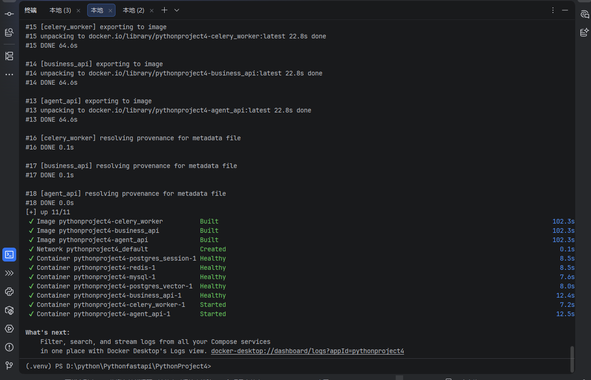

# AI 智能客服 Agent

基于 **Function Calling** 的多工具协同 AI Agent，LLM 自主判断用户意图，从 7 个业务工具中自动选择并执行，集成 RAG 知识库检索和 Reflection 自检机制。

## 架构

```
用户 → FastAPI → Agent 调度 → LLM (Function Calling)
                      │
           ┌──────────┼──────────┐
           ↓          ↓          ↓
      订单查询    物流跟踪    会员服务
           ↓          ↓          ↓
      售后工单    RAG知识库   转人工兜底
           │          │          │
           └──────────┼──────────┘
                      ↓
              Business API → MySQL
                      ↓
        PostgreSQL (会话记忆 + pgvector 向量库)
```

## 能做什么

| 场景 | 用户说什么 | Agent 做什么 |
|------|-----------|-------------|
| 查订单 | "我的所有订单" | 调 `query_all_order` → 返回完整订单列表 |
| 查物流 | "智能电饭煲到哪了" | 调 `query_logistics_by_goods` → 模糊匹配商品→查物流 |
| 退货 | "退掉恒温热水壶" | 调 `initiate_return_by_goods` → 自动匹配订单→提交工单 |
| 查会员 | "我的积分多少" | 调 `query_crm_user_info` → 返回等级/积分/订单数 |
| 政策咨询 | "退换货流程是什么" | 调 `query_knowledge_base` → pgvector RAG 检索 |
| 转人工 | "转人工" | 调 `transfer_human` → 自动创建工单 |

## 快速开始

```bash
# 1. 配置
cp .env.example .env
# 编辑 .env，填入 DASHSCOPE_API_KEY=sk-xxx

# 2. 一行启动
docker compose up -d

# 3. 终端对话
python terminal_chat.py

# 4. 浏览器
# API 文档: http://localhost:8000/docs
# 客服工作台: http://localhost:8000/admin/admin.html
```

## 项目结构

```
├── main.py                    # FastAPI 入口
├── config.py                  # 配置（环境变量驱动）
├── terminal_chat.py           # 终端对话 Demo
├── docker-compose.yml         # 一键启动全部服务
├── Dockerfile
│
├── app/
│   ├── api/                   # REST + WebSocket
│   │   ├── chat.py            # /chat/local, /chat/stream
│   │   ├── task.py            # 异步任务轮询
│   │   ├── admin.py           # 客服工作台 API
│   │   └── ws.py              # WebSocket 推送
│   ├── services/graph/        # Agent 核心调度
│   │   └── tools/
│   │       ├── agent_core.py  # Agent 主调度
│   │       ├── agent_memory.py # 会话记忆
│   │       ├── agent_reflection.py # 自检纠错
│   │       ├── biz_skills/    # 7 个业务 Skill
│   │       └── prompts/       # 系统提示词
│   ├── tasks/                 # Celery 异步任务
│   ├── db/                    # 数据库模型
│   └── utils/                 # LLM/RAG/鉴权/限流/熔断
│
├── business_api/main.py       # 业务微服务（订单/CRM/物流/商品）
├── config/prompts/            # 提示词 YAML（热加载）
├── tests/                     # 29 个测试用例
├── eval/                      # Agent 评估体系（30 条标注）
└── data/                      # 测试数据 SQL
```

## 技术要点

- **Agent 调度**: LLM 通过 Function Calling 自主选择工具，多轮推理，单轮最多 3 步
- **Reflection 自检**: 回复前校验三项 — 是否编造订单号、是否遗漏关键信息、是否匹配用户意图
- **RAG 混合检索**: pgvector 向量检索 + 全文检索 + Re-rank 重排序
- **会话记忆**: Redis + PostgreSQL 双层存储，支持多轮对话上下文
- **转人工闭环**: 情绪识别 → 自动创建工单 → WebSocket 推送客服工作台
- **异步任务**: Celery + Redis，大查询不阻塞对话

## 界面

| 客服工作台 | Docker 服务 | 终端对话 |
|:---:|:---:|:---:|
| [🎬 B站演示](https://www.bilibili.com/video/BV18oMu6eEhp/) |  | [🎬 B站演示](https://www.bilibili.com/video/BV1KNMg6FERL/) |

## License

MIT
